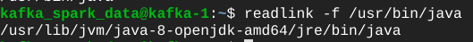

# Spark Kurulumu

Bu döküman sıfır bir `linux` bilgisayara `Spark` kurulumunun nasıl yapıldığını anlatacaktır. 

# Java kurulumu

Spark kurulum için Java' ya ihtiyaç duymaktadır. Bu dokümanda Java olarak Java8 kurulmuştur. 

Java kurulumu:

    sudo apt install openjdk-8-jdk -y

## JAVA_HOME

Spark JAVA_HOME' un ayarlanmasını istemektedir. Bu işlemi gerçekleştirmek için Java' nın kurulu olduğu dizini `.bashrc` dosyasında `JAVA_HOME` adlı bir değişkenine atayarak yaparız.

### Java' nın kurulu olduğu dizini bulmak

`which java` ifadesi java' nın executable file' ının nerede olduğunu bize verir.

    which java

`which` komutunun çıktısını `readlink` komutuna parametre olarak veriyoruz. Bu sayede java' nın kurulu olduğu dizini buluyoruz. 

    readlink -f /usr/bin/java

`readlink` komutunun çıktısının sadece `/usr/lib/jvm/java-8-openjdk-amd64` kısmını kullanacağız.

### JAVA_HOME' u .bashrc' ye eklemek

`vim` ile `$HOME` dizininde `.bashrc` dosyasını açıyoruz.

    cd $HOME
    vim .bashrc

Aşağıdaki ifadeyi dosyanın en sonuna ekliyoruz sonra kaydetip çıkıyoruz.

    export JAVA_HOME=/usr/lib/jvm/java-8-openjdk-amd64

## Spark Kurulumu

Spark' ın 3.2.0 sürümü indirilmiştir.

### Spark indirme

    wget https://dlcdn.apache.org/spark/spark-3.2.0/spark-3.2.0-bin-hadoop3.2.tgz

### Zip' ten çıkarma

    tar -xzvf spark-3.2.0-bin-hadoop3.2.tgz

### SPARK_HOME

Spark' ın çalışması için `SPARK_HOME` gerekmiyor lakin başka programlar için gerekebiliyor. Bunun için

`vim` ile `$HOME` dizininde `.bashrc` dizinini açıyoruz.

    cd $HOME
    vim .bashrc

Aşağıdaki `SPARK_HOME` satırını dosyanın en sonuna ekliyoruz sonra kaydetip çıkıyoruz.

    export SPARK_HOME=$HOME/spark-3.2.0-bin-hadoop3.2

## Spark Çalıştırma

Spark klasörünün içindeki `bin `dizinine giderek spark' ı çalıştırabilirsiniz.

pyspark için:

    ./pyspark

scala spark için:
    ./spark-shell